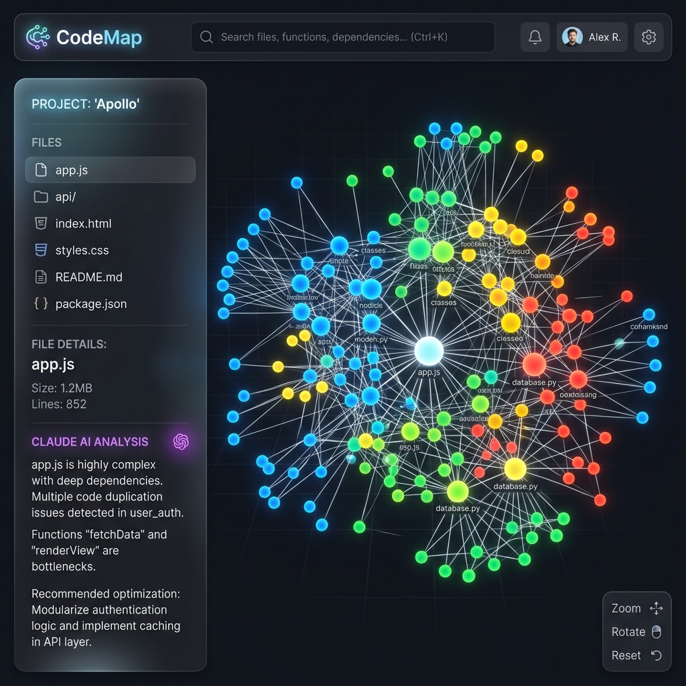

<p align="center">
  
</p>

<h1 align="center">🗺️ CodeMap</h1>

### AI-Powered Codebase Visualizer for GitHub Repositories

[](https://github.com/yourusername/codemap/actions)
[](https://opensource.org/licenses/MIT)
[](http://makeapullrequest.com)

**Visualize any GitHub repository as an interactive 2D/3D force-directed graph.  
AI-powered insights by Claude — understand architecture at a glance.**

[Live Demo](https://codemap.vercel.app) · [Report Bug](https://github.com/yourusername/codemap/issues) · [Request Feature](https://github.com/yourusername/codemap/issues)

</div>

---

## ✨ Features

🔍 **Repository Analysis** — Paste any GitHub repo URL and instantly see its structure  
🌐 **Interactive Graph** — Force-directed 2D & 3D visualization with zoom, pan, and drag  
🎨 **Color-Coded Nodes** — Each file type gets a unique color (JS, CSS, Python, etc.)  
📏 **Size by Complexity** — Node size reflects lines of code  
🤖 **AI Insights** — Click any file to get Claude's analysis: what it does, why it exists, improvements  
📋 **Repo Summary** — One-click AI-generated architecture overview  
🔴 **Dead Code Detection** — AI highlights orphaned and unused files  
🌗 **2D/3D Toggle** — Switch between D3.js (2D) and Three.js (3D) modes  

## 🖼️ Preview & Screenshots

<p align="center">
  
</p>

<details>
<summary><b>✨ Click to see more screenshots</b></summary>
<br>

<p align="center">
  
</p>
</details>

<br>

## 🔒 Security Note
**Your API Keys are safe.** The `.env` file which contains your `GITHUB_TOKEN` and `ANTHROPIC_API_KEY` is completely ignored by Git via the `.gitignore` file. These keys will never be pushed to your repository or exposed to the public.

## 🚀 Quick Start

### Prerequisites

- **Node.js** 18+ 
- **GitHub Token** — [Create one here](https://github.com/settings/tokens) (public_repo scope)
- **Anthropic API Key** — [Get one here](https://console.anthropic.com/) (for AI features)

### Installation

```bash
# Clone the repository
git clone https://github.com/yourusername/codemap.git
cd codemap

# Install all dependencies
npm run install:all

# Set up environment variables
cp .env.example server/.env
# Edit server/.env with your API keys

# Start development server
npm run dev
```

The app will be available at:
- **Frontend**: http://localhost:5173
- **Backend**: http://localhost:3001

## 🏗️ Tech Stack

| Layer | Technology |
|-------|-----------|
| **Frontend** | React 18, Vite, Tailwind CSS |
| **Visualization** | react-force-graph-2d, react-force-graph-3d (D3.js + Three.js) |
| **Backend** | Node.js, Express |
| **GitHub API** | Octokit REST |
| **AI** | Anthropic Claude (claude-sonnet-4-20250514) |
| **CI/CD** | GitHub Actions |

## 📁 Project Structure

```
codemap/
├── client/                 # React + Vite frontend
│   ├── src/
│   │   ├── components/     # Reusable UI components
│   │   ├── hooks/          # Custom React hooks
│   │   ├── pages/          # Page components
│   │   └── utils/          # Helper functions
│   └── ...
├── server/                 # Express backend
│   ├── src/
│   │   ├── routes/         # API endpoints
│   │   ├── services/       # Business logic
│   │   └── utils/          # Helpers
│   └── ...
├── .github/workflows/      # CI/CD
└── README.md
```

## 🔧 Environment Variables

| Variable | Description | Required |
|----------|-------------|----------|
| `GITHUB_TOKEN` | GitHub Personal Access Token | ✅ |
| `ANTHROPIC_API_KEY` | Anthropic Claude API Key | ✅ (for AI features) |
| `PORT` | Server port (default: 3001) | ❌ |

## 🤝 Contributing

Contributions are welcome! Please feel free to submit a Pull Request.

1. Fork the project
2. Create your feature branch (`git checkout -b feature/amazing-feature`)
3. Commit your changes (`git commit -m 'Add amazing feature'`)
4. Push to the branch (`git push origin feature/amazing-feature`)
5. Open a Pull Request

## 📄 License

This project is licensed under the MIT License — see the [LICENSE](LICENSE) file for details.

## 🙏 Acknowledgements

- [react-force-graph](https://github.com/vasturiano/react-force-graph) — Force-directed graph component
- [Anthropic Claude](https://anthropic.com) — AI-powered code analysis
- [Octokit](https://github.com/octokit/rest.js) — GitHub API client
- [Three.js](https://threejs.org/) — 3D rendering
- [D3.js](https://d3js.org/) — 2D data visualization

---

<div align="center">
  <b>⭐ If you found CodeMap useful, please give it a star!</b>
</div>
